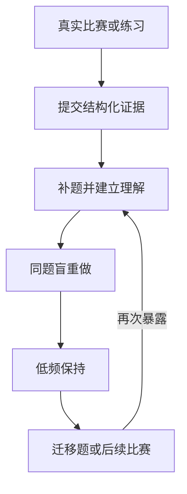

# Architecture

## Core loop

The model boundary is outside this loop: a web chat, API model, or MCP client may read the queue and submit one of the allowed evidence values. Only `lib/training/scheduler.ts` calculates the next state and date.

The current version implements low-frequency retention plus explicitly linked transfer tasks. Contest-level reactivation and automatic transfer recommendation remain later product layers. Repeating the same problem never creates a permanent terminal state.

## Evidence state machine

`reviewStage` is the current same-problem retention rung. `cleanStreak` records consecutive independent completions since the last failed, editorial-assisted, or hinted attempt. `lapseCount` records cumulative failed attempts for later policy analysis.

| Evidence | Clean streak | Result | Next training | Meaning |
|---|---:|---|---:|---|
| `failed` | reset to 0 | `upsolve`, stage 0 | 1 local day | The solution could not be independently reconstructed. |
| `editorial_understood` | reset to 0 | `review`, stage 0 | 2 local days | Understanding after exposure still needs a blind attempt. |
| `hinted_ac` | reset to 0 | `review`, stage 0 | 3 local days | A hint helped; independence remains unverified. |
| first `independent_ac` | 1 | `review`, stage 1 | 3 local days | First clean reconstruction. |
| second `independent_ac` | 2 | `review`, stage 2 | 7 local days | Second consecutive clean reconstruction. |
| third `independent_ac` | 3 | `review`, stage 3 | 21 local days | Retention is strong but transfer remains unknown. |
| fourth `independent_ac` | 4 | `retained`, stage 4 | 45 local days | Low-frequency same-problem maintenance, not permanent mastery. |

After retention, the user or an agent may link an unseen transfer problem. The due card hides the source relationship. A first-attempt `independent_ac` marks the transfer and its source `stable`. Any other first-attempt evidence changes the transfer integrity to `exposed`; later ACs are ordinary same-problem reviews and cannot create transfer evidence.

A retained or stable problem is reactivated when the same tracked problem later receives failed, editorial-assisted, or hinted evidence. Manual capture and Codeforces sync both apply this rule. An independent AC does not reopen an already stable record.

All due timestamps are midnight in `Asia/Shanghai` after the configured number of local calendar days. They are stored as ISO UTC values.

## Queue policy

The daily queue contains due `upsolve`, `review`, and `retained` records. It is ordered as follows:

1. due upsolve debt, oldest due first;
2. unseen transfer checks, oldest due first;
3. due blind review and retention, oldest due first;
4. apply the active daily cap after prioritization.

Normal, recovery, and low-energy modes cap the selected queue at 6, 4, and 2 tasks. Excess debt remains due and visible in the deferred count.

## Persistence

- `problems` stores the current projection state for fast queue reads.
- `attempts` is an append-only evidence history.
- `contests` groups the real event that exposed a set of problems.
- `training_settings` stores the selected daily-load mode and reminder preferences.
- `reminder_jobs` stores one deduplicated delivery intent per date and channel.
- `/api/export` exports contests, problems, attempts, and settings in a versioned JSON envelope.

The append-only attempt log allows future policy migrations to replay evidence instead of trusting only the current projection. Imports run a full validation and dry-run preview before mutating state. Existing records are skipped rather than overwritten.

## Integration boundaries

Notification providers implement `NotificationProvider` in `lib/notifications/types.ts`. Secrets stay in deployment environment variables and never enter D1, exports, logs, or source control.

Agent clients may:

- read the due queue without hidden notes;
- submit one of the allowed evidence values;
- request an explanation of the deterministic decision.

They may never submit an arbitrary review date, stage, clean streak, lapse count, or status.

Codeforces integration uses the public `user.status` endpoint, strips problem tags from candidate data, and requires confirmation for accepted submissions. An online judge verdict cannot establish whether a solution was independent, hinted, or editorial-assisted.

## Public multi-user boundary

The current deployment is owner-only. Before a public multi-user release, add server-side user identity, user IDs on every durable table, row-level authorization in every route, abuse limits, audit logging, and an export/delete flow per user. Do not make the existing personal API public first and add isolation later.
