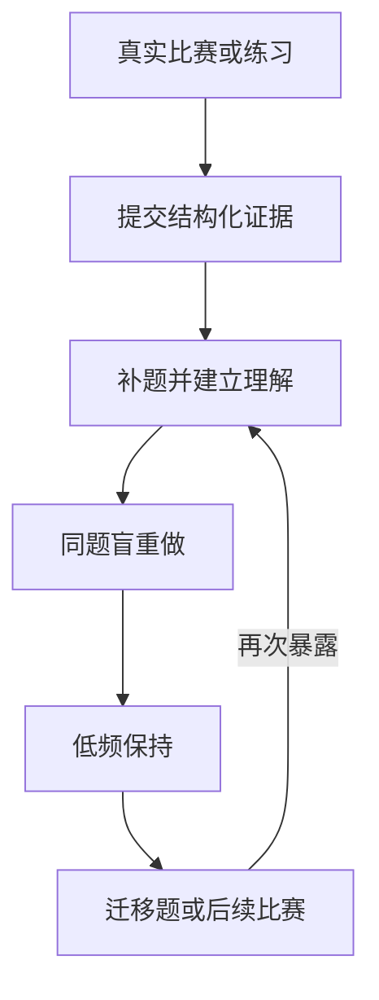

# 架构

## 核心闭环

模型边界位于这个闭环之外。网页聊天、API 模型或 MCP 客户端可以读取队列，并提交一种允许的证据值；只有 `lib/training/scheduler.ts` 可以计算下一状态和日期。

当前版本实现了低频同题保持和显式关联的迁移任务。比赛级重新激活和自动迁移题推荐仍属于后续产品层；重复同一道题永远不会产生永久终态。

## 证据状态机

`reviewStage` 表示当前同题保持阶梯，`cleanStreak` 记录最近一次失败、参考题解或使用提示之后连续独立完成的次数，`lapseCount` 累计失败次数，供后续策略分析。

| 证据 | 连续独立次数 | 结果 | 下次训练 | 含义 |
|---|---:|---|---:|---|
| `failed` | 清零 | `upsolve`，阶段 0 | 1 个本地日 | 无法独立重建解法。 |
| `editorial_understood` | 清零 | `review`，阶段 0 | 2 个本地日 | 接触题解后形成理解，仍需盲做验证。 |
| `hinted_ac` | 清零 | `review`，阶段 0 | 3 个本地日 | 提示帮助完成，独立性仍未验证。 |
| 第一次 `independent_ac` | 1 | `review`，阶段 1 | 3 个本地日 | 第一次完整独立重建。 |
| 第二次 `independent_ac` | 2 | `review`，阶段 2 | 7 个本地日 | 第二次连续独立重建。 |
| 第三次 `independent_ac` | 3 | `review`，阶段 3 | 21 个本地日 | 保持较强，但迁移能力仍未知。 |
| 第四次 `independent_ac` | 4 | `retained`，阶段 4 | 45 个本地日 | 低频同题保持，不代表永久掌握。 |

进入保持后，用户或 Agent 可以关联一道未见迁移题。作答卡隐藏其来源关系；只有第一次尝试的 `independent_ac` 才能把迁移题及原题推进到 `stable`。其他第一次证据会把迁移完整性改为 `exposed`，之后的 AC 只能作为普通同题复习，不能再形成迁移证据。

`retained` 或 `stable` 题收到新的失败、参考题解或提示证据时会重新激活。手动录入和 Codeforces 同步都遵守此规则；已经处于 `stable` 的题再次独立完成只追加 attempt，保持 `stable` 且不建立新的复习日期。

所有到期时间都按 `Asia/Shanghai` 本地日历计算，在目标日 00:00 到期，并以 UTC ISO 时间存储。

## 队列策略

每日队列包含到期的 `upsolve`、`review`、`retained` 和未见迁移记录，依次按以下规则排序：

1. 到期补题债务，最早到期优先；
2. 未完成的迁移验证，最早到期优先；
3. 到期盲做复习与保持，最早到期优先；
4. 状态和到期时间相同时，以稳定数值 ID 升序决胜；
5. 完成全部排序后，再应用活动模式的每日上限。

正常、恢复、低能量模式分别把可用集限制为 6、4、2 项。超出的到期项保持到期，并计入 deferred 数量。

Dashboard、Agent 和提醒都调用 `buildDailyQueue`，因此在相同数据、时间截点和活动模式下得到同一顺序。

## 盲做投影

数据库行不会直接展开到盲做响应。`lib/training/projection.ts` 提供两个显式白名单：

- Dashboard 题目只含 `id`、`title`、`url`、`platform`、`origin`、`status`、`cleanStreak` 和 `nextReviewAt`；
- Agent 到期题只含 `id`、`title`、`url`、`platform`、`origin`、`reviewStage`、`queueType` 和 `dueAt`。

`notes`、`lastEvidence`、`validatesProblemId`、`transferIntegrity`、算法标签、题解和历史解法不会出现在这些 DTO 中。运行时测试比较精确字段集合，因此以后数据库行增加字段也不会自动穿透。

## 持久化

- `problems` 保存当前状态投影，供队列快速读取。
- `attempts` 保存仅追加的证据历史。
- `contests` 关联一场真实事件暴露出的题目。
- `training_settings` 保存活动负荷模式和提醒偏好。
- `reminder_jobs` 按日期和渠道保存去重后的投递意图。
- `/api/export` 以带版本的 JSON 包导出比赛、题目、attempts 和设置。

仅追加 attempt 日志允许未来通过重放证据迁移策略，而不是只信任当前投影。导入会先完整校验并 dry-run 预览，再修改数据；现有比赛和题目会被跳过而不是覆盖。`training_settings.id=1` 也遵守 merge-only：当前设置存在时保留当前值，只有单例缺失时才写入备份设置。

完整导出为 v5，导入兼容 v1-v5；旧 attempt 的帮助等级和幂等键规范化为 `unknown`/`null`。迁移历史是 `0000`-`0005` 的仅追加序列。

## 集成边界

通知渠道在 `lib/notifications/types.ts` 中实现 `NotificationProvider`。密钥只存在于部署环境变量，不能进入 D1、导出、日志或源代码。

Coach 与 Trainer 是单向边界：Coach 只能调用 `getTrainingContext`（安全到期队列）、`setTrainingMode`（用户明确选择的模式）和 `submitTrainingEvidence`（经确认的单次证据）；Trainer 返回确定性回执和后续队列，始终自行计算排程。Coach 不保存或推断排程，不能提交任意复习日期、阶段、连续次数、遗忘次数、状态或迁移完整性。

浏览器普通 API 只接受规范化后精确匹配 `TRAINER_OWNER_EMAIL` 的所有者会话；三个 Coach Actions 接受该所有者会话或正确的 `Authorization: Bearer AGENT_API_KEY`。Bearer key 不授予 Dashboard、导入或导出权限，且只存部署 secret 与 GPT 编辑器凭证，不进入 Instructions、D1、导出或日志。

Codeforces 集成只使用公开的 `user.status` API，从候选数据中删除题目 tags，并要求用户确认 AC 的真实证据。在线评测 verdict 不能证明一次完成是独立、提示后还是参考题解后完成。

## 公开多用户边界

当前部署仅供所有者本人使用。发布可写的多用户版本前，必须增加服务端用户身份、所有持久表的 user ID、每个路由的行级授权、滥用限制、审计日志，以及按用户导出和删除数据的流程。不能先公开当前个人 API，再补数据隔离。
