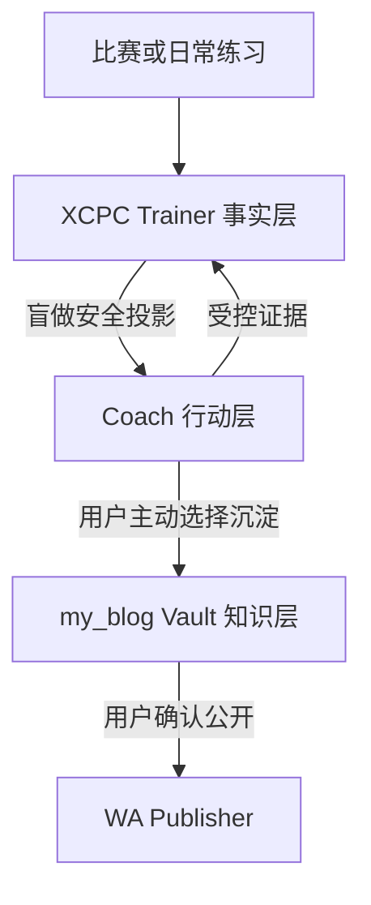

# XCPC Trainer 训练全链路整合设计

**日期：** 2026-08-30  
**状态：** 已完成内部设计确认，待外部评审  
**范围：** 日常训练、比赛分流、Trainer 状态、Obsidian 知识沉淀、隐私与数据流

## 1. 背景

XCPC Trainer 已经具备基于真实证据的确定性排程、盲做复习、迁移验证、比赛会话、数据导入导出和 Agent API。`C:\Documents\my_blog` 中已有另一套经过设计的算法训练与知识入库工作流，优势在于低摩擦启动、有限抢救队列、候选题不成债、渐进提示、比赛分流和按需知识沉淀。

本设计组合两者的优点，但不把两套状态系统直接拼接。XCPC Trainer 继续作为训练事实与排程的唯一权威来源；Coach 只负责当次行动；`my_blog` Vault 只保存用户主动选择沉淀的知识草稿。

### 1.1 权威基线

本规格对应仓库 `H:\Documents\ChatGPT\xcpc_trainer\xcpc-trainer-source-v0.4` 的 v0.4 架构，当前开发 worktree 为 `codex/invariant-hardening`。代码基线已经确认包含四类证据、3/7/21/45 天独立复习间隔、导出 v4、导入 v1-v4、迁移 `0000`-`0004` 和 Agent API 0.4。

`C:\Documents\algo_learning\algorithm-review-reminder` 是独立的旧 Windows 提醒器，使用 D+1/3/7/14/30 和“会/模糊/不会”，不是本规格的实现基线。

## 2. 目标

1. 让每天的训练任务有明确来源、理由、完成线和停止条件。
2. 保留后端确定性排程，同时减少用户当天需要面对的任务数量。
3. 让比赛成为能力采样器，而不是自动生成整场补题债。
4. 通过短期复习、抢救区、候选池和归档控制积压。
5. 在盲做不泄题的前提下支持 H0-H3 渐进陪练。
6. 只把值得长期复用的内容按需沉淀到 Obsidian。
7. 用周复盘寻找可验证的学习证据，而不是追求题量或连续打卡。
8. 保持数据可移植、隐私边界和历史迁移可审查。

## 3. 非目标

- 不让模型选择复习日期或直接修改排程状态。
- 不要求补完一场比赛的所有题。
- 不要求每天写完整题解或维护 Vault。
- 不建立 Trainer 与 Vault 的自动同步服务。
- 不让 Vault 中的状态反向覆盖 Trainer。
- 不自动拆分概念卡片或发布文章。
- 不根据单场比赛或一周题量评价能力。
- 不在当前核心约束加固阶段新增 schema、迁移或导出版本。

## 4. 审查结论

### 4.1 可直接吸收

- 抢救区最多 5 题，同时深入的新题最多 2 道。
- 候选题无期限、无提醒且不构成债务。
- 题目在停止时进入短期复习、抢救区、候选池或归档之一。
- H0-H3 渐进提示与真实训练卡思想。
- 正常、低能量和恢复场景下缩小决策面。
- 比赛按技术、信息和现场决策三层复盘。
- 每周只寻找提示减少、独立步骤、错误拦截和团队决策改善。
- ChatGPT 讲明白、Claudian 按需整理、Publisher 负责公开发布的职责分工。
- 文件夹表示笔记类型，tags 与 Wiki Links 表示知识关系。

### 4.2 必须适配

- `my_blog` 的训练卡日期不能进入 Trainer；`nextReviewAt` 仍只能由后端计算。
- H0-H3 只能作为陪练语言，最终必须映射到现有四类证据。
- Vault 总览不能成为第二套活动队列；Trainer 数据库是唯一训练状态源。
- `S0-S4` 不作为第二套掌握状态引入；沿用 Trainer 的 `status`、`reviewStage` 和 `cleanStreak`。
- 完整题解从“每题必写”改为“满足沉淀标准且用户主动选择时才写”。

### 4.3 不应引入

- 默认整场补题。
- 强制每日维护 Vault。
- 自动写外部服务、自动发布或自动跨仓库同步。
- 为候选池或归档复用现有 `status`、`notes` 或特殊日期值。
- 在个人证据不足时引入 FSRS 或模型生成间隔。

## 5. 总体架构



### 5.1 Trainer：事实层

负责保存比赛、题目当前投影、仅追加尝试、训练模式和提醒。只有后端排程器可以决定 `status`、`reviewStage`、`cleanStreak`、`lapseCount` 和 `nextReviewAt`。

### 5.2 Coach：行动层

Coach 可以是 ChatGPT、Codex Skill 或其他兼容 Agent。它读取安全队列，说明任务来源、完成线和停止条件，按需提供提示，并提交受控证据。它不保存另一套掌握状态，也不自行推算日期。

盲做会话内，Coach 不得读取或引用 Vault、旧题解、标签、Wiki Links、来源关系或历史关键观察。若当前对话已经出现过该题解法，Coach 必须披露上下文已暴露，并改用无该题历史的新会话或受控上下文；不能继续宣称本次是盲做。

### 5.3 Vault：知识层

Vault 只接收用户主动生成的单题 Markdown 草稿。它保存题解、概念卡片、专题地图和复盘，不决定今日队列，不修改 Trainer，也不是盲做上下文来源。

### 5.4 Publisher：公开层

Publisher 负责预览、关联内容确认、构建和发布。只有用户明确选择的内容才能从私有草稿进入公开区。

## 6. 不可破坏的核心约束

- 排程保持确定性；相同输入产生相同状态、日期和队列顺序。
- 队列最终使用稳定唯一 ID 决胜，Dashboard、Agent 和提醒消费者保持一致。
- 盲做前不显示算法标签、旧笔记、题解、历史关键观察、迁移来源或关联原题。
- 客户端不能提交日期、间隔、阶段、连续次数、状态或迁移完整性。
- `attempts` 保持仅追加；状态变化必须能够由证据历史解释。
- 当前加固阶段继续导出 v4、导入 v1-v4。
- 现有迁移 `0000`-`0004` 不修改、不重写。
- 未来任何持久化字段都通过追加 migration 引入，并明确评估导出版本。
- Vault 写入必须由用户主动触发，默认只生成草稿。
- 模式由用户显式选择，默认正常；Coach 不得从情绪、措辞或历史表现自动推断模式。
- “三渠道一致”只约束 Trainer 的证据驱动到期可用集；Coach 的会话级探索建议不属于该契约。

## 7. 日常训练闭环

### 7.1 到期可用集与当次重点分层

| 模式 | Trainer 当日到期可用集上限 | Coach 当次重点 |
|---|---:|---:|
| 正常 | 6 | 最多 3 项 |
| 恢复 | 4 | 0-2 项，可直接休息 |
| 低能量 | 2 | 恰好 1 个可执行动作 |

Trainer 返回的是证据驱动的“当日到期可用集”，不是今日必做清单。Coach 的当次重点从排序后的可用集中顺序截取：正常最多 3 项、恢复最多 2 项、低能量最多 1 项；恢复模式允许用户选择 0 项。

UI 默认只突出当次重点，并把剩余到期项放入标记为“完整到期集”的折叠区域，不得称为“今日待办”。提醒只说明建议重点和仍有到期项，不把完整可用集描述为必须完成的任务。

未被选择或没有开始的题目是“未尝试”：不产生 attempt、不提交 `failed`、不改变 `cleanStreak`，也不推进日期。它只保持原有到期状态，不额外生成“补课债”。

低能量模式没有到期题时，唯一动作可以是休息并结束今日训练；不得为了凑满一项而从候选池拉入新题。

### 7.2 执行顺序

1. 用户显式选择模式；没有选择时使用正常模式。Coach 只在可用时间仍会改变当次重点数量时再询问一次。
2. Trainer 按固定优先级产生安全到期可用集：补题、未暴露迁移、盲做复习与保持、最早到期时间、稳定唯一 ID。
3. “保持”指问题连续第四次独立完成后进入的 `retained` 低频同题维护，当前间隔为 45 天；它不是永久掌握，也不同于迁移验证。
4. Coach 按排序顺序截取当次重点，为每项提供来源、理由、完成线和停止条件。
5. 用户先进行独立尝试，并说明已有模型、预计复杂度或精确卡点。
6. 用户请求帮助后，Coach 每轮只升级一个必要提示。
7. 真实尝试结束后，客户端提交四类证据之一和本次最大帮助等级。
8. Trainer 写入尝试并计算下一状态与日期。
9. Coach 简短总结本次证据、具体卡点、系统生成的下一动作，以及是否值得生成知识草稿。

完成线和停止条件只属于当前会话，不成为新的持久化排程字段。

### 7.3 会话级探索建议

新题、比赛/CF 采样、显式兴趣题和微专题当天步骤属于 Coach 行动层，不进入 Trainer 到期可用集、Dashboard/Agent/提醒一致性契约，也没有持久化计划状态。

- 正常模式下，只有没有待补题债务且用户仍有容量时，Coach 才可以用剩余重点名额建议最多 1 个探索动作。
- 恢复和低能量模式不主动添加新题；用户显式提出兴趣题时仍可执行，但不把它包装成系统到期任务。
- 同一 Coach 会话同时深入的新题最多 2 道。
- 在真实尝试结束前，Trainer 不为探索建议创建 problem、attempt、日期或提醒；结束后再通过普通受控证据入口记录。
- 换会话或换端后，微专题的“校准/核心/变式/验证”阶段可能丢失，这是第一版接受的限制。Coach 只能根据用户提供的信息和已记录的真实 attempts 重新建立建议，不得假装恢复了会话计划。

## 8. 提示与证据映射

| 展示等级 | 含义 |
|---|---|
| H0 | 完全独立完成 |
| H1 | 方向性问题或很弱提示 |
| H2 | 关键观察或模型提示 |
| H3 | 主要解法、完整题解或大量帮助 |

H0 不是未完成尝试的“零提示”标记，而是由“独立 AC 且本次没有获得帮助”推导出的完成等级。attempt 另行记录本次最大帮助等级：`none | h1 | h2 | h3 | unknown`。旧记录或无法确认时使用 `unknown`，不得猜测。

提交真值表：

| 是否 AC | 最大帮助 | 是否形成可靠理解 | Trainer 证据 | 展示 |
|---:|---|---:|---|---|
| 是 | `none` | 是 | `independent_ac` | H0 |
| 是 | `h1`-`h3` 或 `unknown` | 是 | `hinted_ac` | 对应 H1-H3 或未提供 |
| 否 | 通常为 `h3` 或 `unknown` | 是，已理解主要解法 | `editorial_understood` | 对应帮助等级 |
| 否 | `none`-`h3` 或 `unknown` | 否 | `failed` | 未使用、对应帮助等级或未提供 |

同一 attempt 内读题解后再 AC，只能记录 `hinted_ac + h3`；`editorial_understood` 只用于停止时尚未 AC、但已经理解主要解法。未完成且没有使用提示记录 `failed + none`，不能写 H0。

最大帮助等级只补充学习证据，不参与排程。它需要后续追加 migration；旧 attempts 规范化为 `unknown`，新字段默认随下一版完整导出纳入，除非独立规格明确说明排除理由。用户明确要求完整题解时，Coach 直接提供 H3，不以教学流程为由拒绝。迁移题第一次尝试一旦使用非独立证据，Trainer 按现有规则将其标记为已暴露，后续 AC 不能恢复迁移完整性。

## 9. 比赛训练流程

### 9.1 赛前

Coach 确认本场目标、实际分工、读题覆盖、沟通节奏、提交检查规则和切换条件。只确认用户担任队长，不默认用户是主敲手，也不推断队友职责。

### 9.2 赛中

Trainer 不要求持续维护笔记。只记录比赛身份、真实提交、用户主动标记的重要卡点和是否发生有效尝试，避免工具维护打断比赛。

队伍提交结果不等于用户个人暴露状态。赛后逐题分流时由用户自报是否接触过主要解法：`未接触 | 已接触 | 不确定`；`不确定` 在独立性判断中按已接触处理。不能用“队伍 AC”自动推断用户已经理解，也不能用“用户没提交”自动推断题目仍然陌生。

### 9.3 赛后

按三层复盘：

1. 技术层：模型、实现、复杂度和验证错误。
2. 信息层：谁在什么时候掌握了什么信息，是否存在重复劳动或信息未传递。
3. 决策层：开题、切换、提交检查和罚时策略。

每场只保留一个应继续的做法和一个下一场要验证的实验。

比赛决策实验只有在明确写出变量、预期结果和下一场的对照方式时才计入训练证据；“下次注意”“沟通更好”等纯感想不计入。

## 10. 题目四向分流

| 去向 | 进入条件 | 是否排程 | 约束 |
|---|---|---:|---|
| 短期复习 | 已经完成，或已经形成完整模型，但以后能否独立复现仍不确定 | 是 | 使用现有盲做链路 |
| 抢救区 | 已有可行模型，主要卡在证明、实现、边界或验证，并且预计一个专注训练单元内可以推进 | 是 | 最多 5 题 |
| 候选池 | 存在可迁移 insight、常用模型或潜在价值，但当前没有足够证据或容量进入抢救 | 否 | 无期限、无提醒、非债务；未决默认到此 |
| 归档 | 重复、超纲、低收益、上下文不足或失去兴趣 | 否 | 可恢复的主动放弃 |

规则：

- 一道题只能进入一个去向。
- 抢救区已满时，必须先完成、降级或归档旧题。
- 同时深入的新题最多 2 道，但这是 Coach 会话约束，不是 Trainer 队列状态。
- 只有短期复习和抢救题进入确定性排程。
- 候选题不进入 deferred 数量。
- 当前比赛 API 会把录入的暴露题直接送入训练状态，与本目标存在冲突；应在核心约束加固后单独设计比赛分流阶段。
- 无法当场判断去向时默认进入候选池，不为了完成复盘强行制造抢救任务。

当前 contest POST 强制提交至少一道题，并立即创建 problem 与 attempt，因此现有 API 不支持“只建比赛、不建训练状态”。在正式分流 API 落地前，过渡期只能向 Trainer 录入已经明确选择为短期复习或抢救的比赛题；候选、归档和未决题保留在赛后评审输出中，不进入 Trainer。这会牺牲候选池的跨端持久化，但不会制造错误训练债。

当前 schema 没有候选池与归档语义。实现前必须为分流持久化单独写规格，不能复用现有字段假装支持。独立结构必须拥有中立的题目身份；不能只用指向现有排程 `problems` 的 `problem_ref`，否则候选题仍会先污染训练实体。未来规格可以选择让 shelf 行自带题目身份，或先拆出中立题目目录，但不得提前建设两套掌握状态。

新增持久化结构时应追加 migration，并默认进入下一版完整导出；若排除某个新字段，规格必须写明理由。旧备份缺少新结构时导入为空池，不报错、不制造默认候选项，并继续兼容 v1-v4。

## 11. 微专题

只有以下情况触发 3-5 天微专题：

- 同类卡点重复出现；
- 近完成题暴露明确前置缺口；
- 复习持续依赖较强提示。

默认流程为：

```text
校准 → 核心模型 → 一个变式 → 限时验证
```

比赛密集时可以缩短或暂停。专题题目仍通过普通证据入口记录，不建立第二套排程器，也不转变为从头扫知识点题单。

第一版微专题只存在于同一 Coach 会话中，不进入 Trainer 到期可用集或提醒。每个步骤发生真实尝试后才记录对应 problem 与 attempt；“校准/核心/变式/限时验证”只作为解释语言，不作为持久状态。换会话造成阶段丢失属于已接受限制，只有观察到重复恢复成本后才考虑独立计划持久化。

## 12. 按需知识沉淀

### 12.1 触发条件

真实尝试结束后，满足以下任一条件时可以建议生成草稿：

- 暴露了可能重复出现的错误；
- 存在明确、可迁移的 Key Insight；
- 是微专题的代表题；
- 正确性或实现细节容易遗忘；
- 迁移题验证了可复用模型；
- 用户明确要求保留。

普通 AC、重复题或没有新信息的训练只保留 Trainer 尝试记录。

### 12.2 流程

```text
完成真实尝试
→ Trainer 记录证据并完成排程
→ Coach 询问是否生成草稿
→ 用户确认
→ 预览单题 Markdown
→ 信息不足进入 vault/inbox/
→ 信息完整进入 vault/drafts/problems/
→ 必要时才拆 concept/map
→ 用户通过 WA Publisher 预览并发布
```

第一版复用 `my_blog` 现有模板和 Publisher。最短实现可以是 Markdown 预览、复制或下载，不需要跨仓库自动同步服务。

### 12.3 最低质量门槛

草稿至少回答：

1. 本质模型是什么；
2. 第一版思路为什么失败；
3. 关键观察是什么；
4. 为什么不会漏解或多算；
5. 复杂度来自哪里；
6. 下次看到什么具体信号应想到它。

信息不足时标记 `待补充` 或 `这里是推断`，不得编造代码、复杂度、平台或结论。

### 12.4 盲做隔离

- 盲做开始前不读取或展示关联 Vault 内容。
- Coach 的系统协议必须禁止在盲做会话中调用文件工具读取 `vault/`，也不得利用当前对话已经出现的旧解法；上下文已暴露时必须换用无历史上下文。
- 迁移题不得通过 tags、Wiki Links 或来源关系泄露模型。
- 本次证据提交完成后，才可以调用旧笔记做复盘对照。
- Vault 中的掌握状态、提示等级和日期不反向覆盖 Trainer。
- 用户从 Vault 主动选择兴趣题时，必须通过 Trainer 受控入口建立训练记录。

盲做安全使用两类不同验证：HTTP API 与 Dashboard 使用精确字段白名单契约测试，多一个字段即失败；Coach 使用行为 fixture，预置“Vault 已有完整题解”的场景，验证其拒绝读取并且响应不泄露标签、模型、关键观察或来源关系。模型 fixture 是行为验收，不能替代确定性的接口字段测试。

### 12.5 my_blog 模板解耦

现有 my_blog 模板中的 frontmatter `status` 只表示笔记生命周期；“首次提示等级”“当前状态 S0-S4”“下次复习”及任何日期、阶段、连续次数字段都不是 Trainer 输入。按需导出的 Markdown 默认不生成这些训练状态字段；即使旧模板仍包含它们，Trainer 也不解析、不导入、不反向同步。

## 13. 隐私分层

| 数据 | 默认位置 | 默认公开 |
|---|---|---:|
| 排程、尝试、比赛、设置 | Trainer 数据库与 JSON 备份 | 否 |
| 原始想法、不完整草稿 | `vault/inbox/` | 否 |
| 完整题解和概念草稿 | `vault/drafts/` | 否 |
| 用户确认发布的文章 | `vault/published/` | 是 |

按需导出先显示将要生成的单题 Markdown，得到用户确认后再保存。不批量复制 Trainer 备份，不自动公开私人 notes。

## 14. 周复盘与长期反馈

### 14.1 时间

默认每周日 20:00（`Asia/Shanghai`）触发周复盘。统计窗口为半开区间 `[上个周日 20:00, 本周日 20:00)`，相邻窗口首尾连续且不重叠；本周日 20:00 及之后的证据进入下一窗口。

是否与比赛冲突以用户明确声明“比赛尚未结束”为准，不依赖可能滞后的比赛记录。冲突时执行动作顺延至赛后首次空闲时段，但仍消费原固定窗口，不能扩大到实际执行时刻。错过后只补一次提示；若整周跳过，证据仍保留在 attempts 中，但不生成补做复盘债务。

第一版将周日 20:00 作为固定产品规则，不复用现有每日提醒的 `training_settings.reminderTime`，也不为可配置时间提前新增字段。只有固定时间被真实使用证明不合适后，才设计配置能力。

### 14.2 统计口径

计入训练质量：盲重做、迁移首次尝试、四类受控证据、lapse、连续独立完成、迁移完整性，以及明确记录的比赛决策实验。

不计入训练质量：首次录题、未确认独立性的 OJ AC、配置、演示、fixture、生成题解、发布文章和单纯题量。

周复盘开头声明本窗口的数据源基线，至少包括总 attempt 数、有效盲做数、迁移首次尝试数、独立 AC 数和非独立/失败数。没有对应数据时显示 0，不用题量替代质量结论。

### 14.3 每周证据

优先寻找：

1. 旧题使用了更少帮助；
2. 新增了一个可独立完成的步骤；
3. 主动拦住了一个重复错误；
4. 改善了一项比赛沟通或现场决策。

证据可以为零，不为填满模板而虚构。

“使用了更少帮助”只在两个 attempts 都有可比较的最大帮助等级时成立；`unknown` 与旧记录不能被自动解释为任何 H 级。在帮助等级字段落地前，这项只能依据用户明确记录的真实对照，不作为自动统计结论。

周复盘在证据足够时，将主要 blocker 归入“算法模型、复杂度推演、代码实现、验证、协作/现场决策”之一，用于判断是否触发微专题。没有用户记录或尝试证据支持时写“未提供”，不得由 Coach 猜测分类。本分类第一版只属于复盘输出，不提前增加持久化字段。

### 14.4 每周输出

```text
数据源：attempt / 有效盲做 / 迁移首次尝试 / 独立 AC / 非独立或失败
本周保留：一个已经有效的做法
本周问题：一个反复出现的具体阻塞
下周实验：一个可验证的小改变
队列处理：抢救区是否超限，哪些应降级或归档
专题决定：继续、缩短、暂停或结束
```

没有证据时先调整难度、任务结构或停止条件，不增加题量。在积累至少 30-50 次有效盲做或迁移尝试前，不调整 3/7/21/45 天间隔。

## 15. 异常处理

- Trainer 不可用或状态过期：Coach 披露限制，只提供不依赖活动队列的安全动作。
- 证据提交失败：不显示“已记录”，不在客户端推算日期；重新加载服务端状态后再处理。
- OJ 返回 AC：仍需用户确认是否独立完成。
- 抢救区已满：不静默加入第 6 题。
- Vault 草稿失败：不回滚或修改已记录的 Trainer 证据，允许重新导出。
- Markdown 信息不足：进入 `inbox` 并标注缺失项。
- 发布失败：草稿保留在 `drafts`，不影响训练状态。
- 导入校验或预览失败：不写入任何数据。
- 盲做字段投影不符合白名单：接口失败或测试失败，不返回完整数据库行。
- 证据提交前允许取消；提交后 attempt 不编辑、不删除。普通题误标只能由后续真实 attempt 提供新的状态证据，历史误标仍保留。当前版本对已经错误验证的迁移题没有安全纠错通道，因此迁移首次证据提交前必须二次确认；观察到真实误标需求后，再单独设计仅追加 correction event。

现有 `/api/reviews` 与 `/api/agent/evidence` 共用同一写路径：问题投影更新和 attempt 插入虽在同一批次中完成，但如果服务端已提交而响应在网络中丢失，使用相同内容重试仍会新增 attempt 并再次推进排程。界面禁用重复点击不能解决该故障。

目标幂等语义为：

1. 客户端在一次真实尝试开始时生成一个不透明 `idempotencyKey`，同一次提交的所有网络重试复用该值；不增加“先向服务端申请 Token”的预请求。
2. 服务端通过持久唯一约束原子地认领该 key，并在同一事务边界内更新问题投影、插入 attempt。
3. 相同 key 与相同提交内容再次到达时不改变状态，返回“此前已接收”并要求客户端刷新当前投影。
4. 相同 key 携带不同题目、证据或 notes 时返回冲突，避免把编程错误伪装成重试。
5. 浏览器与 Agent API 使用同一语义；内存缓存、按钮防抖和请求时间戳都不能代替持久去重。

真正实现上述语义需要为 attempt 增加可唯一约束的持久标识，并评估它在完整备份中的表示方式。当前核心约束加固阶段不修改 schema；应在后续独立规格中通过追加 migration 完成，并明确导出版本与旧备份导入兼容策略。

## 16. 分阶段验收

### 16.1 当前核心约束加固

1. 原生 Windows 和 POSIX npm 工作流可运行。
2. 稳定题后续独立 AC 不会重新排期，非独立证据仍会重新激活。
3. Dashboard 与 Agent 盲做响应使用精确字段白名单，不含旧笔记、标签、迁移来源和历史关键观察。
4. 相同输入在 Dashboard、Agent 和提醒消费者中以稳定 ID 决胜，队列顺序相同。
5. 设置导入采用仅合并语义；当前阶段保持 v4 导出、v1-v4 导入和 `0000`-`0004` 迁移不变。

### 16.2 下一阶段：证据完整性

1. 模拟服务端已经提交但客户端未收到响应；复用相同 `idempotencyKey` 重试后只存在一条 attempt，排程只推进一次。
2. 完成/独立真值表覆盖四类证据；读题解后 AC 只能成为 `hinted_ac + h3`，未完成无提示只能成为 `failed + none`。
3. 新 attempt 保存最大帮助等级，旧记录为 `unknown`；新字段默认随新导出版本导出，旧备份继续可导入。
4. 提交前可取消，提交后没有编辑或删除入口。

### 16.3 Coach 行动协议

1. 模式由用户显式选择，默认正常；Coach 不自动推断。
2. 正常模式 Trainer 最多返回 6 项、Coach 突出最多 3 项；低能量最多返回 2 项且只给一个动作。
3. 未尝试不产生证据、状态或日期变化。
4. 新题与微专题只存在于 Coach 会话；不进入到期集或提醒，真实尝试后才入库。
5. Vault 中预置完整题解时，盲做行为 fixture 仍不泄露模型、标签、关键观察或来源关系。
6. 周复盘窗口严格为 `[上个周日 20:00, 本周日 20:00)`，边界无遗漏、无重复。

### 16.4 后置比赛分流

1. 比赛题经用户显式分流后恰好进入短期复习、抢救、候选或归档之一；未决默认候选。
2. 抢救区不超过 5 题，候选题无日期、提醒和欠账。
3. 用户个人解法暴露状态不由队伍提交结果推断。
4. 新版完整导出包含分流持久化数据；旧备份导入得到空候选/归档池。

### 16.5 按需知识沉淀

1. 只有完成真实尝试且用户确认后才生成单题草稿。
2. 生成内容忽略 my_blog 中的 S0-S4、下次复习和其他 Trainer 所有字段。
3. Trainer、Vault 或 Publisher 任一环节失败，不错误推进其他层状态。

### 16.6 学习效果

试运行后至少出现提示减少、独立步骤、错误拦截或比赛决策改善之一；否则调整结构而非增加题量。提示减少只有在帮助等级可比较时才成立。

## 17. 实施边界

本设计不是当前核心约束加固阶段的扩项。顺序必须保持：

1. 先完成跨平台命令、稳定题证据守卫、盲做字段白名单、确定性决胜和导入合并语义等加固工作。
2. 加固完成后第一项工作是 evidence 完整性规格：先复现重复推进，再设计客户端稳定 key、服务端持久唯一约束和最大帮助等级；不增加预申请 Token 服务。
3. evidence 幂等落地前，不扩大远程 Agent API 联调范围。
4. 再为比赛分流和候选/归档持久化编写独立规格，决定中立题目身份、migration 与导出版本。
5. Coach 行动层优先复用现有 Agent API 和行为协议；新题与微专题保持会话级，不建立第二套排程服务。
6. Vault 对接优先使用单题 Markdown 预览、复制或下载；只有出现明确、重复的手工痛点后再评估自动化。

## 18. 外部评审重点

请评审者重点检查：

1. 后台 6/4/2 与前台 3/0-2/1 的分层是否清晰且不会误导用户。
2. H0-H3 到四类证据的映射是否覆盖真实做题情形。
3. 四向分流是否真正避免了全场补题债。
4. 候选池和归档是否应作为独立持久化结构，而不是新的训练状态。
5. Trainer、Coach、Vault 和 Publisher 的单向边界是否足以避免状态分叉和盲做泄露。
6. 周日 20:00 的周复盘及冲突顺延语义是否明确。
7. 网络中断后的重复证据风险是否需要在后续阶段优先处理。
8. 所有后续持久化变化是否继续保持旧备份可导入和迁移历史仅追加。

## 19. 外部评审一处理结果

- 接受：三层边界、双层任务漏斗、四向分流、按需知识沉淀与仅追加数据演进保持不变。
- 接受并收窄：周复盘增加 blocker 分类，但只在真实证据支持时分类，不强制填写或自动推断。
- 接受问题、调整方案：重复提交风险成立；使用客户端生成的稳定 `idempotencyKey`，不采用服务端预申请 `attempt_token`，因为后者增加一次往返且仍需要相同的持久唯一约束。
- 阶段边界：幂等改造在扩大远程 Agent API 联调前完成，但不塞入当前承诺无 schema 变化的核心约束加固阶段。

## 20. 外部评审二处理结果

- 接受 D1：周复盘改为 `[上个周日 20:00, 本周日 20:00)`，冲突由用户声明，顺延不扩大窗口。
- 接受 D2 的信息保留目标并调整字段：attempt 保存 `none | h1 | h2 | h3 | unknown` 最大帮助等级；H0 仍只表示独立完成，不能出现 H0-failed。
- 选择 D3 的会话级方案：新题与微专题不是 Trainer 队列或提醒状态，最多同时深入 2 题由 Coach 协议约束，真实尝试后才入库；跨会话阶段丢失是第一版明确接受的限制。
- 接受呈现与模式澄清：到期可用集不叫今日待办；未尝试无证据无变化；模式由用户显式选择。
- 接受证据排他边界：读题解后 AC 为 `hinted_ac + h3`，`editorial_understood` 仅用于未 AC 但理解主解。
- 接受分流改进：给出可复述判据，未决默认候选，用户个人解法暴露由本人自报。
- 调整过渡行为：现有 contest API 不支持空比赛，因此分流功能落地前只录入已明确成为短期复习或抢救的题，不声称当前 API 能只建比赛记录。
- 接受 Coach 泄题防线、周复盘数据源、幂等优先级、默认导出新字段、旧备份空池和阶段化验收。
- 不直接采用评审给出的 `shelf_items.problem_ref` 草图：现有 `problems` 是排程实体，未来分流规格必须先解决中立题目身份，避免候选题污染训练状态。
- 证据纠错第一版保持提交前确认、提交后不可编辑或删除；只有真实误标需求出现后才设计仅追加 correction event。
- 基线核对完成：本规格对应新 XCPC Trainer；旧 `algorithm-review-reminder` 不是同一实现。
