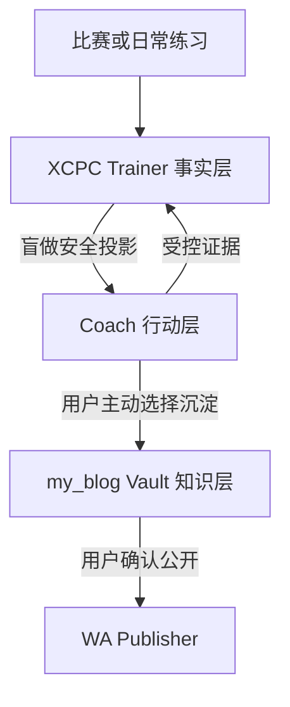

# XCPC Trainer 训练全链路整合设计

**日期：** 2026-08-30  
**状态：** 已完成内部设计确认，待外部评审  
**范围：** 日常训练、比赛分流、Trainer 状态、Obsidian 知识沉淀、隐私与数据流

## 1. 背景

XCPC Trainer 已经具备基于真实证据的确定性排程、盲做复习、迁移验证、比赛会话、数据导入导出和 Agent API。`C:\Documents\my_blog` 中已有另一套经过设计的算法训练与知识入库工作流，优势在于低摩擦启动、有限抢救队列、候选题不成债、渐进提示、比赛分流和按需知识沉淀。

本设计组合两者的优点，但不把两套状态系统直接拼接。XCPC Trainer 继续作为训练事实与排程的唯一权威来源；Coach 只负责当次行动；`my_blog` Vault 只保存用户主动选择沉淀的知识草稿。

## 2. 目标

1. 让每天的训练任务有明确来源、理由、完成线和停止条件。
2. 保留后端确定性排程，同时减少用户当天需要面对的任务数量。
3. 让比赛成为能力采样器，而不是自动生成整场补题债。
4. 通过短期复习、抢救区、候选池和归档控制积压。
5. 在盲做不泄题的前提下支持 H0-H3 渐进陪练。
6. 只把值得长期复用的内容按需沉淀到 Obsidian。
7. 用周复盘寻找可验证的学习证据，而不是追求题量或连续打卡。
8. 保持数据可移植、隐私边界和历史迁移可审查。

## 3. 非目标

- 不让模型选择复习日期或直接修改排程状态。
- 不要求补完一场比赛的所有题。
- 不要求每天写完整题解或维护 Vault。
- 不建立 Trainer 与 Vault 的自动同步服务。
- 不让 Vault 中的状态反向覆盖 Trainer。
- 不自动拆分概念卡片或发布文章。
- 不根据单场比赛或一周题量评价能力。
- 不在当前核心约束加固阶段新增 schema、迁移或导出版本。

## 4. 审查结论

### 4.1 可直接吸收

- 抢救区最多 5 题，同时深入的新题最多 2 道。
- 候选题无期限、无提醒且不构成债务。
- 题目在停止时进入短期复习、抢救区、候选池或归档之一。
- H0-H3 渐进提示与真实训练卡思想。
- 正常、低能量和恢复场景下缩小决策面。
- 比赛按技术、信息和现场决策三层复盘。
- 每周只寻找提示减少、独立步骤、错误拦截和团队决策改善。
- ChatGPT 讲明白、Claudian 按需整理、Publisher 负责公开发布的职责分工。
- 文件夹表示笔记类型，tags 与 Wiki Links 表示知识关系。

### 4.2 必须适配

- `my_blog` 的训练卡日期不能进入 Trainer；`nextReviewAt` 仍只能由后端计算。
- H0-H3 只能作为陪练语言，最终必须映射到现有四类证据。
- Vault 总览不能成为第二套活动队列；Trainer 数据库是唯一训练状态源。
- `S0-S4` 不作为第二套掌握状态引入；沿用 Trainer 的 `status`、`reviewStage` 和 `cleanStreak`。
- 完整题解从“每题必写”改为“满足沉淀标准且用户主动选择时才写”。

### 4.3 不应引入

- 默认整场补题。
- 强制每日维护 Vault。
- 自动写外部服务、自动发布或自动跨仓库同步。
- 为候选池或归档复用现有 `status`、`notes` 或特殊日期值。
- 在个人证据不足时引入 FSRS 或模型生成间隔。

## 5. 总体架构



### 5.1 Trainer：事实层

负责保存比赛、题目当前投影、仅追加尝试、训练模式和提醒。只有后端排程器可以决定 `status`、`reviewStage`、`cleanStreak`、`lapseCount` 和 `nextReviewAt`。

### 5.2 Coach：行动层

Coach 可以是 ChatGPT、Codex Skill 或其他兼容 Agent。它读取安全队列，说明任务来源、完成线和停止条件，按需提供提示，并提交受控证据。它不保存另一套掌握状态，也不自行推算日期。

### 5.3 Vault：知识层

Vault 只接收用户主动生成的单题 Markdown 草稿。它保存题解、概念卡片、专题地图和复盘，不决定今日队列，不修改 Trainer，也不是盲做上下文来源。

### 5.4 Publisher：公开层

Publisher 负责预览、关联内容确认、构建和发布。只有用户明确选择的内容才能从私有草稿进入公开区。

## 6. 不可破坏的核心约束

- 排程保持确定性；相同输入产生相同状态、日期和队列顺序。
- 队列最终使用稳定唯一 ID 决胜，Dashboard、Agent 和提醒消费者保持一致。
- 盲做前不显示算法标签、旧笔记、题解、历史关键观察、迁移来源或关联原题。
- 客户端不能提交日期、间隔、阶段、连续次数、状态或迁移完整性。
- `attempts` 保持仅追加；状态变化必须能够由证据历史解释。
- 当前加固阶段继续导出 v4、导入 v1-v4。
- 现有迁移 `0000`-`0004` 不修改、不重写。
- 未来任何持久化字段都通过追加 migration 引入，并明确评估导出版本。
- Vault 写入必须由用户主动触发，默认只生成草稿。

## 7. 日常训练闭环

### 7.1 队列上限与行动重点分层

| 模式 | Trainer 后台队列上限 | Coach 当日重点 |
|---|---:|---:|
| 正常 | 6 | 最多 3 项 |
| 恢复 | 4 | 0-2 项，可直接休息 |
| 低能量 | 2 | 恰好 1 个可执行动作 |

Trainer 返回的是当天可用队列，不代表用户必须全部完成。未完成项目保持原有到期状态，不额外生成“补课债”。

低能量模式没有到期题时，唯一动作可以是休息并结束今日训练；不得为了凑满一项而从候选池拉入新题。

### 7.2 执行顺序

1. 只有当可用时间或精力会改变任务时，Coach 才询问一次状态。
2. Trainer 按固定优先级产生安全队列：补题、未暴露迁移、盲做复习与保持、最早到期时间、稳定唯一 ID。
3. Coach 从队列中选出当日重点，为每项提供来源、理由、完成线和停止条件。
4. 用户先进行独立尝试，并说明已有模型、预计复杂度或精确卡点。
5. 用户请求帮助后，Coach 每轮只升级一个必要提示。
6. 真实尝试结束后，客户端提交四类证据之一。
7. Trainer 写入尝试并计算下一状态与日期。
8. Coach 简短总结本次证据、具体卡点、系统生成的下一动作，以及是否值得生成知识草稿。

完成线和停止条件只属于当前会话，不成为新的持久化排程字段。

## 8. 提示与证据映射

| 提示等级 | 含义 |
|---|---|
| H0 | 完全独立完成 |
| H1 | 方向性问题或很弱提示 |
| H2 | 关键观察或模型提示 |
| H3 | 主要解法、完整题解或大量帮助 |

提交规则：

| 实际结果 | Trainer 证据 |
|---|---|
| 未获得帮助并独立 AC | `independent_ac` |
| 获得 H1-H3 帮助后 AC | `hinted_ac` |
| 已获得并理解主要解法，但未建立独立完成证据 | `editorial_understood` |
| 停止时仍未完成，也未形成可靠理解 | `failed` |

未完成题不能标记为 H0。用户明确要求完整题解时，Coach 直接提供 H3，不以教学流程为由拒绝。迁移题第一次尝试一旦使用非独立证据，Trainer 按现有规则将其标记为已暴露，后续 AC 不能恢复迁移完整性。

## 9. 比赛训练流程

### 9.1 赛前

Coach 确认本场目标、实际分工、读题覆盖、沟通节奏、提交检查规则和切换条件。只确认用户担任队长，不默认用户是主敲手，也不推断队友职责。

### 9.2 赛中

Trainer 不要求持续维护笔记。只记录比赛身份、真实提交、用户主动标记的重要卡点和是否发生有效尝试，避免工具维护打断比赛。

### 9.3 赛后

按三层复盘：

1. 技术层：模型、实现、复杂度和验证错误。
2. 信息层：谁在什么时候掌握了什么信息，是否存在重复劳动或信息未传递。
3. 决策层：开题、切换、提交检查和罚时策略。

每场只保留一个应继续的做法和一个下一场要验证的实验。

## 10. 题目四向分流

| 去向 | 进入条件 | 是否排程 | 约束 |
|---|---|---:|---|
| 短期复习 | 已完成，但无法确认以后能独立复现 | 是 | 使用现有盲做链路 |
| 抢救区 | 接近做出、当前能力范围内且收益较高 | 是 | 最多 5 题 |
| 候选池 | 有价值，但当前不值得占用训练容量 | 否 | 无期限、无提醒、非债务 |
| 归档 | 重复、超纲、低收益、上下文不足或失去兴趣 | 否 | 可恢复的主动放弃 |

规则：

- 一道题只能进入一个去向。
- 抢救区已满时，必须先完成、降级或归档旧题。
- 同时深入的新题最多 2 道。
- 只有短期复习和抢救题进入确定性排程。
- 候选题不进入 deferred 数量。
- 当前比赛 API 会把录入的暴露题直接送入训练状态，与本目标存在冲突；应在核心约束加固后单独设计比赛分流阶段。

当前 schema 没有候选池与归档语义。实现前必须为分流持久化单独写规格，不能复用现有字段假装支持。若新增持久化结构，应追加 migration，并决定是否将完整可移植导出升级为新版本，同时继续兼容旧备份导入。

## 11. 微专题

只有以下情况触发 3-5 天微专题：

- 同类卡点重复出现；
- 近完成题暴露明确前置缺口；
- 复习持续依赖较强提示。

默认流程为：

```text
校准 → 核心模型 → 一个变式 → 限时验证
```

比赛密集时可以缩短或暂停。专题题目仍通过普通证据入口记录，不建立第二套排程器，也不转变为从头扫知识点题单。

## 12. 按需知识沉淀

### 12.1 触发条件

真实尝试结束后，满足以下任一条件时可以建议生成草稿：

- 暴露了可能重复出现的错误；
- 存在明确、可迁移的 Key Insight；
- 是微专题的代表题；
- 正确性或实现细节容易遗忘；
- 迁移题验证了可复用模型；
- 用户明确要求保留。

普通 AC、重复题或没有新信息的训练只保留 Trainer 尝试记录。

### 12.2 流程

```text
完成真实尝试
→ Trainer 记录证据并完成排程
→ Coach 询问是否生成草稿
→ 用户确认
→ 预览单题 Markdown
→ 信息不足进入 vault/inbox/
→ 信息完整进入 vault/drafts/problems/
→ 必要时才拆 concept/map
→ 用户通过 WA Publisher 预览并发布
```

第一版复用 `my_blog` 现有模板和 Publisher。最短实现可以是 Markdown 预览、复制或下载，不需要跨仓库自动同步服务。

### 12.3 最低质量门槛

草稿至少回答：

1. 本质模型是什么；
2. 第一版思路为什么失败；
3. 关键观察是什么；
4. 为什么不会漏解或多算；
5. 复杂度来自哪里；
6. 下次看到什么具体信号应想到它。

信息不足时标记 `待补充` 或 `这里是推断`，不得编造代码、复杂度、平台或结论。

### 12.4 盲做隔离

- 盲做开始前不读取或展示关联 Vault 内容。
- 迁移题不得通过 tags、Wiki Links 或来源关系泄露模型。
- 本次证据提交完成后，才可以调用旧笔记做复盘对照。
- Vault 中的掌握状态、提示等级和日期不反向覆盖 Trainer。
- 用户从 Vault 主动选择兴趣题时，必须通过 Trainer 受控入口建立训练记录。

## 13. 隐私分层

| 数据 | 默认位置 | 默认公开 |
|---|---|---:|
| 排程、尝试、比赛、设置 | Trainer 数据库与 JSON 备份 | 否 |
| 原始想法、不完整草稿 | `vault/inbox/` | 否 |
| 完整题解和概念草稿 | `vault/drafts/` | 否 |
| 用户确认发布的文章 | `vault/published/` | 是 |

按需导出先显示将要生成的单题 Markdown，得到用户确认后再保存。不批量复制 Trainer 备份，不自动公开私人 notes。

## 14. 周复盘与长期反馈

### 14.1 时间

默认每周日 20:00（`Asia/Shanghai`）触发周复盘。统计窗口固定为本周一 00:00 至周日 20:00；周日 20:00 之后的证据进入下一周。若与比赛冲突，执行动作顺延至赛后首次空闲时段，但统计窗口不扩大；错过后只补一次提示，不形成补做债务。

第一版将周日 20:00 作为固定产品规则，不复用现有每日提醒的 `training_settings.reminderTime`，也不为可配置时间提前新增字段。只有固定时间被真实使用证明不合适后，才设计配置能力。

### 14.2 统计口径

计入训练质量：盲重做、迁移首次尝试、四类受控证据、lapse、连续独立完成、迁移完整性，以及明确记录的比赛决策实验。

不计入训练质量：首次录题、未确认独立性的 OJ AC、配置、演示、fixture、生成题解、发布文章和单纯题量。

### 14.3 每周证据

优先寻找：

1. 旧题使用了更少帮助；
2. 新增了一个可独立完成的步骤；
3. 主动拦住了一个重复错误；
4. 改善了一项比赛沟通或现场决策。

证据可以为零，不为填满模板而虚构。

### 14.4 每周输出

```text
本周保留：一个已经有效的做法
本周问题：一个反复出现的具体阻塞
下周实验：一个可验证的小改变
队列处理：抢救区是否超限，哪些应降级或归档
专题决定：继续、缩短、暂停或结束
```

没有证据时先调整难度、任务结构或停止条件，不增加题量。在积累至少 30-50 次有效盲做或迁移尝试前，不调整 3/7/21/45 天间隔。

## 15. 异常处理

- Trainer 不可用或状态过期：Coach 披露限制，只提供不依赖活动队列的安全动作。
- 证据提交失败：不显示“已记录”，不在客户端推算日期；重新加载服务端状态后再处理。
- OJ 返回 AC：仍需用户确认是否独立完成。
- 抢救区已满：不静默加入第 6 题。
- Vault 草稿失败：不回滚或修改已记录的 Trainer 证据，允许重新导出。
- Markdown 信息不足：进入 `inbox` 并标注缺失项。
- 发布失败：草稿保留在 `drafts`，不影响训练状态。
- 导入校验或预览失败：不写入任何数据。
- 盲做字段投影不符合白名单：接口失败或测试失败，不返回完整数据库行。

如果服务端已经保存证据，但网络在返回前中断，重试可能造成重复尝试并重复推进排程。这是现有流程需要单独验证的正确性风险。当前加固阶段不因此修改 schema；后续应先复现风险，再设计最小幂等方案。

## 16. 验收场景

1. 正常模式下 Trainer 最多返回 6 项，Coach 只突出最多 3 项。
2. 低能量模式下 Trainer 最多返回 2 项，Coach 只给一个动作。
3. 盲做响应不存在旧笔记、题解、标签、迁移来源和历史关键观察。
4. H0-H3 稳定映射到四类证据，未完成题不会成为 H0。
5. 相同输入在 Dashboard、Agent 和提醒渠道产生相同队列顺序。
6. 比赛题恰好进入四个去向之一，不默认整场补题。
7. 抢救区不超过 5 题，候选题无日期、提醒和欠账。
8. 只有完成真实尝试且用户确认后才生成单题草稿。
9. 周复盘在每周日 20:00 触发，只使用真实训练证据。
10. 当前阶段保持 v4 导出、v1-v4 导入和 `0000`-`0004` 迁移不变。
11. Trainer、Vault 或 Publisher 任一环节失败，不错误推进其他层状态。
12. 试运行后至少出现提示减少、独立步骤、错误拦截或比赛决策改善之一；否则调整结构而非增加题量。

## 17. 实施边界

本设计不是当前核心约束加固阶段的扩项。顺序必须保持：

1. 先完成跨平台命令、稳定题证据守卫、盲做字段白名单、确定性决胜和导入合并语义等加固工作。
2. 再为比赛分流和候选/归档持久化编写独立规格，决定 migration 与导出版本。
3. Coach 行动层优先复用现有 Agent API 和行为协议，不建立第二套排程服务。
4. Vault 对接优先使用单题 Markdown 预览、复制或下载；只有出现明确、重复的手工痛点后再评估自动化。

## 18. 外部评审重点

请评审者重点检查：

1. 后台 6/4/2 与前台 3/0-2/1 的分层是否清晰且不会误导用户。
2. H0-H3 到四类证据的映射是否覆盖真实做题情形。
3. 四向分流是否真正避免了全场补题债。
4. 候选池和归档是否应作为独立持久化结构，而不是新的训练状态。
5. Trainer、Coach、Vault 和 Publisher 的单向边界是否足以避免状态分叉和盲做泄露。
6. 周日 20:00 的周复盘及冲突顺延语义是否明确。
7. 网络中断后的重复证据风险是否需要在后续阶段优先处理。
8. 所有后续持久化变化是否继续保持旧备份可导入和迁移历史仅追加。
