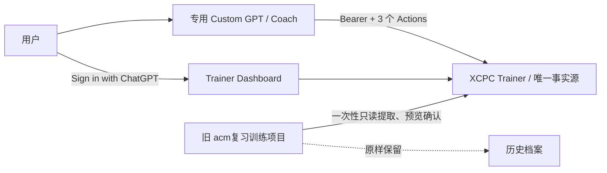

# XCPC Trainer × ChatGPT Action Coach 设计

**日期：** 2026-08-31

**状态：** 已完成设计确认，待用户复核书面规格

**范围：** Custom GPT Actions、托管鉴权、证据幂等、帮助等级、旧训练控制台一次性迁移

## 1. 背景与目标

当前 XCPC Trainer 已能在本地维护确定性排程，但在 ChatGPT 网页端训练时仍需要手工复制队列和证据。用户希望继续使用网页对话，不购买或维护 OpenAI API 调用，并把既有 ChatGPT 项目“acm复习训练”中的“训练控制台”历史保留下来。

本阶段建立一个专用 Custom GPT 作为 Coach，通过 Actions 读写 XCPC Trainer。Trainer 仍是唯一事实源；Custom GPT 只负责当次训练对话。旧项目和旧对话保持原样作为可追溯档案，再进行一次性、可预览的历史迁移。

成功标准：

1. 用户在专用 GPT 中可以读取当天安全队列、显式切换训练模式并提交一次真实尝试，不再手工复制结构化数据。
2. 模型不能提交或覆盖 `nextReviewAt`、阶段、连续次数、状态等排程字段。
3. 盲做响应继续使用精确白名单，不返回旧笔记、题解、算法标签、迁移来源或历史关键观察。
4. 网络超时后的同一提交重试只产生一条 attempt；相同 key 的不同内容必须冲突。
5. 新 attempt 结构化保存最大帮助等级；完整导出升级为 v5，导入继续兼容 v1-v5。
6. 旧训练控制台中的可识别题目和历史记录可以逐步进入正常复习，但不会在导入当天形成批量到期债务。

## 2. 与全链路规格的关系

本规格实现 `2026-08-30-integrated-training-workflow-design.md` 中“证据完整性优先于远程 Agent API 扩大联调”的下一阶段，不改变以下约束：

- `training_settings.id=1` 是训练模式的唯一权威设置；模式不是单次上下文请求参数。
- 排程以 `Asia/Shanghai` 日历和现有 3/7/21/45 天规则确定性计算。
- `attempts` 仅追加；客户端不能编辑或删除已提交证据。
- 现有 migrations `0000`-`0004` 原样保留，只新增 `0005`。
- Vault、ChatGPT 对话和旧训练卡都不能反向提供当前排程日期。
- Coach 不建立第二套状态、候选池或微专题排程器。

## 3. 非目标

- 不接入 OpenAI 模型 API，不保存 OpenAI API key，也不产生模型 API 账单。
- 不把普通 ChatGPT 项目对话改造成 Custom GPT；当前产品边界下新建专用 GPT，旧对话保留为档案。
- 不建设 MCP/OAuth 服务、独立网关、浏览器扩展、自动跨仓库同步或长期双向同步。
- 不向首版 Action 暴露比赛创建、迁移题创建、批量导入导出或知识发布能力。
- 不让 Coach 自动推断正常、恢复或低能量模式。
- 不自动抓取题解或利用旧对话记忆宣称完成盲做。
- 不在本阶段实现候选池、归档、比赛四向分流或微专题持久化。

## 4. 方案选择

采用 **Custom GPT Actions + Bearer API Key**：

- 复用现有 OpenAPI、Agent 路由和 `AGENT_API_KEY`，实现路径最短。
- GPT Actions 的 API key 由 GPT 配置保存，不进入仓库、D1、提示词、导出或日志。
- 用户继续在 ChatGPT 网页端对话，不需要模型 API key。

暂不采用的方案：

- **MCP 插件：** 私有远程 MCP 需要 OAuth 2.1，适合以后必须连接任意普通对话时再评估。
- **只读 Action：** 仍需手工回填证据，不能解决主要摩擦。
- **自建聊天页：** 会重复 ChatGPT 已有的对话、身份和模型能力。

官方产品约束以 OpenAI 文档为准：[GPT Action authentication](https://developers.openai.com/api/docs/actions/authentication)、[Sites authentication](https://learn.chatgpt.com/docs/sites)。

## 5. 总体架构



部署后的 Site 可以通过公共 HTTPS 地址访问，但训练数据不是公开数据。匿名访问只能看到登录入口；浏览器数据 API 只允许指定所有者；Custom GPT 调用 Agent API 时必须使用专用高熵 Bearer key。精确匹配的所有者会话也可调用 Agent API 进行浏览器冒烟，其他登录用户不能访问。

## 6. Custom GPT 的三个 Actions

公开给 Custom GPT 的 OpenAPI 文档只声明以下三个 operation。现有其他 API 可以继续供 Dashboard 或后续开发使用，但不是本 GPT 的能力契约。

### 6.1 `getTrainingContext`

`GET /api/agent/context`

无 mode 参数。服务端读取 `training_settings.id=1`；缺失或非法时使用 `normal`。响应包含：

- `generatedAt`
- `mode`
- `dailyLimit`：正常/恢复/低能量分别为 6/4/2
- `focusLimit`：分别为 3/2/1
- `dueCount`、`deferredCount`
- `due`：按既有确定性规则排序和截断后的安全题目
- `acceptedEvidence`、`acceptedHelpLevels`
- 只读排程政策和盲做说明

`due` 中每题严格限制为：

```text
id, title, url, platform, origin, reviewStage, queueType, dueAt
```

多一个字段也视为契约失败。不得返回 `notes`、题解、算法标签、旧代码、历史关键观察、`validatesProblemId`、迁移来源关系或完整数据库行。

系统建议重点是排序后队列的前 `focusLimit` 项。Coach 可以在用户明确选择后少做或休息，但不能重排并把另一组题称为系统建议。

### 6.2 `setTrainingMode`

`PUT /api/agent/mode`

请求只允许：

```json
{ "mode": "normal | recovery | low_energy" }
```

只有用户在当前对话中明确说出模式或明确要求切换时，Coach 才能调用。Coach 不得根据情绪、时间、用词或历史表现推断模式。服务端写入唯一的 `training_settings.id=1`，返回 `mode`、`dailyLimit` 和 `focusLimit`；之后 Coach 必须重新读取上下文。

### 6.3 `submitTrainingEvidence`

`POST /api/agent/evidence`

请求白名单：

```json
{
  "problemId": 123,
  "evidence": "failed | editorial_understood | hinted_ac | independent_ac",
  "helpLevel": "none | h1 | h2 | h3 | unknown",
  "notes": "用户确认的简短真实记录",
  "idempotencyKey": "同一次真实尝试及其所有重试共用的稳定 key"
}
```

`idempotencyKey` 必填，是 16-128 字符的不透明高熵字符串；一次新的真实尝试必须使用新 key。客户端不能提交日期、状态、阶段、连续次数、lapse、排程理由或迁移完整性。

写响应不能转发 `/api/reviews` 的完整 problem。固定白名单为：

```text
recorded, replayed, attemptId, problemId, evidence, helpLevel,
nextStage, scheduledAt, scheduleReason
```

重试命中时从已保存 attempt 返回同一份尝试快照，不把以后可能已经变化的当前 problem 投影伪装成原提交结果。Coach 随后重新调用 `getTrainingContext` 获取当前状态。

## 7. Coach 对话协议

### 7.1 开始训练

1. 用户明确选择模式；没有切换要求时沿用 Trainer 当前模式。
2. Coach 读取上下文，只把系统建议重点作为当次入口。
3. 每次只处理一题，先询问用户当前模型、复杂度判断或精确卡点。
4. 未被选择或未开始的题不产生 attempt，不记录 `failed`，不改变日期。

### 7.2 渐进提示

- H0：AC、未获帮助且能可靠重建核心模型、关键依据和复杂度。
- H1：方向性问题或很弱提示。
- H2：关键观察或模型提示。
- H3：主要解法、完整题解或大量帮助。

用户请求帮助时每轮只升级一级必要提示。用户明确要求完整解法时可以直接给 H3。盲做期间不得主动读取旧训练控制台、Vault 或题解；若当前会话已经出现过本题主要解法，Coach 必须说明上下文已暴露，本次不能再称为盲做。

### 7.3 证据真值表

| 是否 AC | 最大帮助 | 可靠理解 | 证据 |
|---:|---|---:|---|
| 是 | `none` | 是 | `independent_ac` |
| 是 | `h1`-`h3` 或 `unknown` | 是 | `hinted_ac` |
| 是 | 任意 | 否 | `failed` |
| 否 | 通常 `h3` 或 `unknown` | 是，已理解主解 | `editorial_understood` |
| 否 | 任意 | 否 | `failed` |

读题解后 AC 只能是 `hinted_ac + h3`；`editorial_understood` 只用于停止时尚未 AC、但已理解主要解法。蒙对、机械复用旧代码或无法解释关键步骤时，即使 OJ 已 AC 也不能记为 `independent_ac`。

### 7.4 提交确认

调用写 Action 前，Coach 必须展示题目、四类证据、最大帮助等级和 notes 摘要，并获得用户明确确认。用户取消或没有确认时不写入。提交成功后只复述服务端白名单结果，不自行计算或修改下次日期。

## 8. 鉴权与部署边界

### 8.1 浏览器所有者

托管环境设置 `TRAINER_OWNER_EMAIL`。浏览器 Dashboard 及普通数据 API 只接受平台注入的 `oai-authenticated-user-email`，经 trim 和小写规范化后必须与该 secret 精确相等。

- 未登录：401 或跳转 Sign in with ChatGPT。
- 已登录但不是所有者：403。
- 托管环境缺少 `TRAINER_OWNER_EMAIL`：失败关闭，不返回训练数据。
- 本地开发没有平台身份头时，只允许 loopback 访问；不得把该便利扩展到托管环境。

### 8.2 Action 凭证

托管环境设置独立的 `AGENT_API_KEY`：

- 使用密码管理器生成的高熵随机值，不复用登录密码或 GitHub token。
- 只通过 `Authorization: Bearer <key>` 传递。
- 不进入仓库、D1、GPT 指令、notes、日志或导出。
- 缺失或错误返回 401，并带 Bearer challenge。

GPT Action 的 API key 由 GPT 编辑器保存。`TRAINER_OWNER_EMAIL` 与 `AGENT_API_KEY` 相互独立。Agent 路由的授权矩阵固定为“精确匹配的所有者会话 **或** 正确 Bearer key”；Custom GPT 的远程调用不能依赖用户身份头，任意非所有者登录也不能绕过 Bearer。`AGENT_API_KEY` 不授予 Dashboard、导入或导出等普通浏览器 API 权限，不能伪装浏览器所有者。

### 8.3 公开面

- `GET /api/openapi` 可以公开，但只描述三个 Coach operations，且 schema 使用 `additionalProperties: false` 限制写请求。
- 页面静态壳和登录入口可以公开；任何训练数据必须先鉴权。
- 不启用通配 CORS，不建立第二个代理层。
- 生产部署先迁移远程 D1，再设置 secrets，最后开放 Custom GPT 联调。

## 9. `0005`：证据完整性迁移

只追加 `drizzle/0005_*.sql`，不修改 `0000`-`0004` 或历史 journal 内容。

`attempts` 新增：

- `idempotency_key TEXT NULL`
- `help_level TEXT NOT NULL DEFAULT 'unknown'`
- `UNIQUE INDEX attempts_idempotency_key_unique ON attempts(idempotency_key)`

SQLite 唯一索引允许多条 `NULL`，因此旧 attempts 保持可迁移。应用层只接受 `none | h1 | h2 | h3 | unknown`；旧数据统一为 `unknown`，不猜测历史帮助等级。

### 9.1 幂等语义

1. 新请求先按 `idempotencyKey` 执行带唯一约束的 attempt 插入，并与 problem 投影更新处于同一原子批次。
2. 首次提交成功：只产生一条 attempt，排程只推进一次。
3. 唯一冲突后读取已有 attempt，规范化比较 `problemId`、`evidence`、`helpLevel` 和 `notes`。
4. 内容相同：返回 200、`recorded=true`、`replayed=true`，不再更新 problem。
5. 内容不同：返回 409，不插入、不更新、不猜测调用者意图。

按钮防抖、内存缓存、请求时间戳和“先申请 token”都不能代替该持久唯一约束。浏览器与 Action 最终共用同一写入函数和同一幂等语义，避免两条写路径漂移。

## 10. 导出与导入 v5

完整导出升级为 v5，attempt 默认包含 `helpLevel` 与 `idempotencyKey`。导入支持 v1-v5：

- v1-v4 attempt 规范化为 `helpLevel=unknown`、`idempotencyKey=null`。
- v5 校验帮助等级枚举、key 格式和非空 key 的唯一性。
- 同 key、同规范化 payload 的已有 attempt 视为已导入并跳过；同 key、不同 payload 冲突。备份内部重复 key 直接拒绝。所有情况都先在 dry-run 中报告，冲突时不写入。
- 现有 settings 继续采用仅合并语义；备份不能覆盖当前权威训练模式。
- 既有 v4 及更早备份无需修改即可导入。
- 导入仍先 dry-run，任何验证失败都不产生部分写入。

## 11. 旧“训练控制台”一次性迁移

### 11.1 来源与保留

旧 ChatGPT 项目“acm复习训练”和对话“训练控制台”不删除、不改名、不自动同步，继续作为原始档案。迁移只读取该对话中完整 `[TRAINING_CARD]` 和能够明确识别题目身份、日期、结果与帮助信息的记录；其他聊天不自动扩大范围。

迁移数据不提交到 Git。实施时优先在内存中生成本地预览，用户确认后才写入 Trainer；若工具必须产生临时明文文件，只放入系统临时目录并在交付时明确列出，由用户确认后清理。原始对话始终可追溯。

### 11.2 字段映射

保留：

- 题名、平台、规范化 URL、来源说明。
- 原尝试日期、结果、最大 H 等级。
- blocker、trigger、用户证据、明确标为推断的内容和原始简短备注。

映射规则：

- H0 且可靠独立完成 → `independent_ac + none`
- H1-H3 后 AC → `hinted_ac + h1|h2|h3`
- 未 AC 但理解主解 → `editorial_understood + 对应帮助等级`
- 其余 → `failed + 已知帮助等级或 unknown`

旧卡片的 `nextReview`、S0-S4、旧排程状态和旧间隔全部忽略。blocker 与 trigger 作为历史 notes 保存，不参与排程；没有证据的字段写“未提供”，不得补猜。

每条历史 attempt 使用“来源对话标识 + 规范化记录 + 同内容出现序号”生成稳定摘要作为 `idempotencyKey`，因此重复执行预览或迁移不会重复追加。

### 11.3 题目去重与现有状态保护

题目先按规范化 URL 去重；无 URL 时才使用“平台 + 规范化题名”，并进入人工确认列表。

- 已存在于 Trainer：只追加缺失的历史 attempts，不覆盖当前 problem 的状态、阶段、连续次数、lapse 或 `nextReviewAt`。
- Trainer 中不存在：创建普通 practice problem，保存历史 attempts，但不重放旧排程。
- 多个链接疑似同题、同链接题名冲突或证据无法排他映射：进入迁移报告，不自动合并或写入。

### 11.4 温和重新激活

对新创建的旧题，后端忽略旧日期并按确定性顺序分配新的首次复习日，每个上海自然日最多 1 题：

1. 最新结果优先级：`failed` → `editorial_understood` → `hinted_ac` → `independent_ac`；
2. 同结果按 H3 → H2 → H1 → H0/none → unknown；
3. 再按最早历史尝试日期；
4. 最后按规范化 URL、平台与题名决胜。

第 1 题在确认导入当日到期，第 n 题在第 n-1 个上海自然日后到期。新题当前投影统一从 `status=review`、`reviewStage=0`、`cleanStreak=0` 开始，`lastEvidence` 保留最新映射结果；历史 attempts 仅作审计证据，不直接推进当前投影。这个显式的 `legacy_chat_import` 初始化规则表示“从今天重新建立可验证掌握度”，不是对旧 scheduler 的重放，因此当前投影仍可由迁移上下文和历史证据解释。这样失败旧题不会在导入时全部进入 `upsolve` 债务。第一次真实复习提交后，现有确定性排程完全接管。

这是一套一次性导入规则，不建立永久同步服务。以后旧对话中新产生的内容不自动进入 Trainer。

## 12. 错误处理

| 情况 | 行为 |
|---|---|
| 401 / 403 | Coach 停止，不重试，提示检查登录或 Action key |
| 404 problem | 不提交替代 ID；刷新上下文后让用户确认 |
| 409 key 冲突 | 停止并报告冲突，不生成新 key 掩盖错误 |
| 超时 / 5xx | 使用完全相同的 `idempotencyKey` 和内容重试最多一次 |
| 用户取消确认 | 不调用写 Action |
| 上下文已经泄露解法 | 披露非盲做，必要时换无历史的新会话 |
| 历史迁移存在歧义 | 留在报告和旧档案，不猜测、不写入 |
| 历史迁移中途失败 | 整批回滚；重新 dry-run 后再确认 |

## 13. 测试与验收

### 13.1 自动测试

1. 鉴权矩阵覆盖匿名、所有者、非所有者、正确/错误 Bearer key，以及生产缺少 secret 的失败关闭。
2. OpenAPI 只包含三个 operation；所有写 schema 拒绝额外字段和排程字段。
3. Agent context 的题目投影与精确白名单完全相等，多一个隐藏字段即失败。
4. Action 写响应只含约定白名单，不转发完整 problem 或 notes。
5. 同 key 同内容重试只有一条 attempt、排程只推进一次；同 key 不同内容返回 409 且状态不变。
6. `helpLevel` 五种枚举与证据真值表通过；非法值拒绝。
7. `0005` 在全新数据库和已应用 `0000`-`0004` 的数据库上均能应用，重复执行不改历史。
8. v5 导出包含两个新字段；v1-v4 导入得到 `unknown/null`；v1-v5 均可 dry-run 和导入。
9. 旧训练卡解析、稳定去重、歧义报告和“一天最多 1 题”的排序有最小确定性测试。
10. 既有 `npm test`、`npm run lint`、`npm run build` 和本地/远程 migration 检查继续通过。

### 13.2 ChatGPT 手工冒烟

1. 在专用 GPT 明确说“切换到低能量模式”，确认 Trainer 持久化为 `low_energy`，并重新读取最多 2 项、重点最多 1 项。
2. 选择一题，确认 Coach 先问模型/复杂度/卡点，没有泄露旧 notes 或迁移关系。
3. 请求 H1，再完成尝试；Coach 展示 `hinted_ac + h1` 摘要并等待确认。
4. 确认后只写一次；模拟响应丢失并重试，仍只有一条 attempt。
5. 刷新 Dashboard，队列、模式和服务端日期与 GPT 结果一致。
6. 用非所有者账号打开 Site，确认无法读取 Dashboard 数据。
7. 导入一小份脱敏旧训练卡，确认已有题不改状态、新题按一天一题重新激活。

## 14. 发布顺序与回滚

发布顺序：

1. 实现并验证 `0005`、共享证据写路径、v5 导入导出和鉴权。
2. 对远程 D1 做 v4 备份并应用 `0005`。
3. 在 Site 设置 `TRAINER_OWNER_EMAIL` 和 `AGENT_API_KEY`。
4. 部署公共 HTTPS Site，验证所有者与非所有者访问。
5. 在 Custom GPT 中导入只含三个 Actions 的 OpenAPI，并配置 Bearer key 与 Coach 指令。
6. 完成一条脱敏 attempt 冒烟后再处理真实队列。
7. 对旧训练控制台先 dry-run、人工复核歧义报告，再执行一次性迁移。

回滚优先关闭外部入口而不删除数据：禁用 GPT Action、轮换 `AGENT_API_KEY`、限制 Site 访问或回滚应用代码。`0005` 和已经写入的 attempts 不删除、不逆向迁移；旧 v4 备份仍可导入支持 v1-v5 的版本。历史迁移出现问题时保留旧对话和迁移报告，不覆盖现有 Trainer 状态。

## 15. 实施边界

本规格可以由一份实施计划完成，但按可用性分为两个连续里程碑：

1. **先可用：** `0005`、v5 数据兼容、所有者鉴权、三个 Actions、专用 GPT 指令与端到端冒烟。
2. **再融合：** 旧训练控制台 dry-run、歧义复核、一次性迁移与温和重新激活。

第一个里程碑未通过幂等、盲做白名单和鉴权测试前，不开放真实远程写入。第二个里程碑不阻塞新 GPT 试用，因为旧项目和对话始终原样保留；但在迁移确认前，不宣称旧历史已经进入 Trainer。
